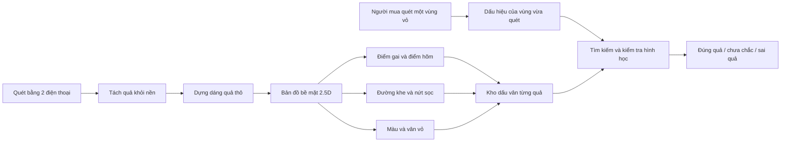
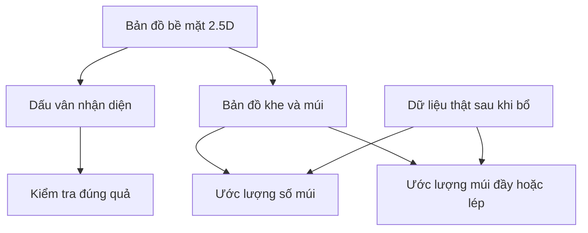

# Bản Thiết Kế Thử Nghiệm Sầu Riêng

## Mục tiêu

Xây hệ thống dữ liệu cho 2 bài toán bằng cùng một quy trình lấy mẫu:

1. **Xác minh đúng quả**: kiểm tra quả đang quét có đúng là quả đã đăng ký hay không.
2. **Đánh giá chất lượng**: ước lượng số múi, múi đầy/lép, tỷ lệ cơm ăn được, độ chín và lỗi hư hỏng từ hình ảnh ngoài vỏ.

Nguyên tắc chính: **quét không phá quả để dự đoán**, nhưng **bổ một phần mẫu để lấy dữ liệu kiểm chứng thật**.

## Bản Tóm Tắt Dễ Hiểu

- Mỗi quả sầu riêng có một “dấu vân” tự nhiên trên vỏ: gai, hõm, khe múi, vết nứt sọc, màu và vân vỏ.
- Khi lấy mẫu, ta quay/chụp quả nhiều góc để tạo bản đồ bề mặt.
- Sau này người mua chỉ cần quét một vùng nhỏ trên vỏ, hệ thống tìm xem vùng đó có khớp với quả đã lưu hay không.
- Cùng dữ liệu này cũng giúp dự đoán số múi, múi lép/đầy và tỷ lệ cơm, nhưng phần này cần bổ một số quả để kiểm chứng.

## Từ Điển Ngắn

| Thuật ngữ trong tài liệu | Nghĩa dễ hiểu |
| --- | --- |
| MVP / bản thử nghiệm | Bản làm đủ dùng để lấy mẫu và kiểm chứng ý tưởng, chưa phải sản phẩm hoàn chỉnh |
| Dấu vân bề mặt | Dấu hiệu riêng của gai, hõm, khe và vân vỏ trên từng quả |
| Bản đồ bề mặt 2.5D | Bản đồ trải phẳng lớp vỏ, có thêm thông tin lồi/lõm tương đối |
| Điểm gai | Vị trí gai nổi bật dùng để nhận diện |
| Điểm hõm | Vùng lõm giữa cụm gai |
| Khe/nứt sọc | Đường chia múi nhìn được trên vỏ |
| Dữ liệu kiểm chứng thật | Dữ liệu sau khi bổ quả: số múi, cân cơm, cân hạt, cân vỏ |
| Mâm xoay | Bàn quay quả khi quay video |
| Mốc góc | Vạch/tem trên mâm để biết quả đang quay tới góc nào |
| LiDAR / đo sâu | Cảm biến đo khoảng cách/độ sâu, dùng phụ trợ chứ không làm nguồn chính |
| Grade thương mại | Nhãn A/B/dạt do người mua/người bán đang dùng; chỉ dùng để đối chiếu với dữ liệu đo thật |
| Tỷ lệ cơm ăn được | `edible_flesh_weight / whole_fruit_weight`, tính sau khi bổ |

## Quyết Định Đã Chốt

- Định danh ở mức **đúng quả cụ thể**, không chỉ đúng lô/vườn.
- Đăng ký gốc có thể dùng bộ quét riêng; người mua kiểm tra bằng điện thoại.
- Dấu vân chính ưu tiên **gai/vỏ từ video màu**, không dựa vào mô hình lưới 3D từ LiDAR làm nguồn chính.
- LiDAR / đo sâu chỉ dùng phụ trợ: lấy tỷ lệ kích thước, dáng thô, vị trí tương đối.
- Người mua nên quét **một vùng nhỏ bất kỳ** thay vì phải quét đủ 360 độ.
- Tem/QR chỉ để quản lý hoặc tăng tốc, không phải bằng chứng chính.
- Về sản phẩm nên cho phép tìm không cần QR, nhưng máy chủ vẫn nên ưu tiên theo lô/ngày/khu vực trước để giảm nhầm.
- Dữ liệu gốc nên tạo **bản đồ bề mặt 2.5D** thay vì chỉ lưu ảnh rời.
- Tách **grade thương mại** khỏi dữ liệu đo thật; MVP chỉ ghi lại grade và lý do chấm để so với số múi/cân cơm sau khi bổ.
- Dấu vân nên có thời hạn hiệu lực tạm 3-6 tháng, đủ cho vòng đời từ vườn tới người mua và giúp kho tìm kiếm không phình vô hạn.
- Bản thử nghiệm lấy mẫu phải phục vụ cả xác minh đúng quả và đánh giá chất lượng ngay từ đầu vì quả đã bổ thì không phục hồi được.

## Bộ Quét Thử Nghiệm Ở Hà Nội

Thiết kế tối thiểu để lấy mẫu lặp lại ổn định:

- 2 điện thoại quay đồng thời.
- `C1`: máy ngang nhìn thân quả; nếu có LiDAR thì dùng làm máy chính.
- `C2`: máy chéo trên khoảng 45 độ để thấy cuống, đỉnh và khe múi.
- Mâm xoay làm bánh dùng được, dù quay không đều.
- Dán một mốc góc `zero` và 8-12 vạch quanh viền mâm để ước lượng góc quay thật từ video.
- Hộp sáng/khung tản sáng bán kín.
- Nền xám matte trung tính.
- Khóa nét, khóa sáng, khóa cân bằng trắng trước mỗi lượt lấy mẫu.
- Ưu tiên 4K/30fps; nếu máy yếu, nóng hoặc thiếu sáng thì dùng 1080p/30fps.

Không nên dùng máy quay nhìn thẳng từ trên xuống 90 độ làm video chính. Góc trên 90 độ chỉ nên là ảnh phụ cho cuống/đáy nếu cần.

## Hiệu Chuẩn

Mục tiêu thực tế: quét lặp lại sai lệch khoảng **3-5 mm**, không cần đạt 1 mm ở bản thử nghiệm.

Quy trình:

- Mỗi ngày: chụp bảng caro/Charuco để kiểm tra máy quay.
- Mỗi lượt lấy mẫu: quay thước đo + mốc trên mâm trong 2-3 giây đầu video.
- Đồng bộ 2 điện thoại bằng nháy đèn hoặc vỗ tay lúc bắt đầu, sau đó dùng mốc trên mâm để tính góc quay.

Nguồn tỷ lệ kích thước chính nên đến từ bộ máy quay đã cố định và hiệu chuẩn. LiDAR chỉ là phụ trợ.

## Mã Mẫu Và Tem

Nên mua máy in nhiệt nếu đi lấy nhiều quả theo cây/vườn.

Tem:

- In QR/DataMatrix + chữ đọc được bằng mắt.
- Dán cả túi/thùng và dây tem buộc quả để tránh mất dấu.
- Không dán trực tiếp lên quả nếu ảnh hưởng phần quét.
- Khi quét chính: quay tem 1-2 giây, tháo dây tem khỏi quả, rồi quét.

Cấu trúc mã video:

```text
MA_VUON-MA_CAY-SO_QUA-LUOT_QUET-MAY_QUAY
```

Dạng ngắn đang dùng để đặt tên file:

```text
FARM-TREE-FRUIT-PASS-CAM
```

Ví dụ:

```text
DL01-T012-F003-A-C1
DL01-T012-F003-A-C2
DL01-T012-F003-B-C1
DL01-T012-F003-B-C2
```

Trong Excel, `fruit_id = DL01-T012-F003`.

## Nhóm Mẫu

### Mẫu ghi nhận nhanh tại nơi mua

Mẫu quét nhanh ở nơi mua/vườn, chất lượng thấp, dùng để giữ dấu vết nguồn và theo dõi vận chuyển.

Tối thiểu:

- video điện thoại thô 15-30s,
- ảnh cuống,
- ảnh đáy,
- cân nặng nếu tiện.

Không cần hộp sáng, mô hình lưới 3D, hay bản đồ bề mặt.

### Mẫu quét chính bằng bộ quét

Quét chính ở Hà Nội trước khi bổ, dùng cho xác minh đúng quả và đánh giá chất lượng.

### Mẫu bổ kiểm chứng sau vận chuyển

Quả mua/ship về Hà Nội rồi mới bổ. Vẫn có dữ liệu kiểm chứng thật sau khi bổ.

Nếu chỉ quét được một mốc, ưu tiên quét ngay trước khi bổ.

### Mẫu không bổ

Quét/cân nhưng không bổ. Dùng cho xác minh đúng quả, theo dõi thay đổi theo thời gian; không dùng làm dữ liệu kiểm chứng ruột.

## Nhãn Grade Thương Mại

MVP chưa cần tự động chấm A/B/dạt ngay. Việc cần làm trước là ghi lại cách con người đang chấm để sau này so với dữ liệu thật.

Ghi tối thiểu:

- `commercial_grade`: `A`, `B`, `offgrade`.
- `grade_reason`: tròn, kích thước, 2.7 múi to, 2.5 múi, kem, đồ, lỗi khác.

Không coi grade thương mại là nhãn đúng tuyệt đối. Dữ liệu kiểm chứng chính vẫn là `segment_count`, `segment_labels`, `edible_flesh_weight`, `seed_weight`, `shell_weight`.

## Quy Trình Mỗi Quả

### Trước khi bổ

1. Cân cả quả: `whole_fruit_weight`.
2. Ghi thông tin tối thiểu, gồm `commercial_grade` nếu người bán/người mua đã chấm.
3. Quay tem bằng cả 2 điện thoại.
4. Tháo dây tem khỏi quả nếu che bề mặt.
5. Quét lượt A.
6. Lật/đổi tư thế quét lượt B.
7. Lượt C không bắt buộc, chỉ làm nếu vùng bị che còn nhiều.
8. Chụp ảnh phụ: cuống, đáy, 4 mặt nếu tiện.

Với 1 máy quay thì nên 3 lượt. Với 2 máy quay ngang + chéo, bắt đầu bằng 2 lượt là đủ cho bản thử nghiệm.

### Sau khi bổ

1. Chụp mặt cắt toàn quả.
2. Chụp từng múi/khoang.
3. Ghi `segment_count`.
4. Cân:
   - `shell_weight`,
   - `edible_flesh_weight`,
   - `seed_weight`.
5. Ghi nhãn từng múi:
   - đầy,
   - vừa,
   - lép,
   - hư/thối/sâu.

Nên có một mốc định hướng dữ liệu, ví dụ chấm mực thực phẩm tại khe số 0 trước khi bổ. Khi bổ vẫn ghi thủ công theo thứ tự múi quanh cuống.

## Bảng Excel Chính Tối Thiểu

Mỗi video/lượt một dòng hoặc mỗi quả một dòng kèm đường dẫn thư mục đều được. Bản thử nghiệm nên bắt đầu đơn giản: mỗi video/lượt một dòng, có chung `fruit_id`.

Tên cột giữ dạng tiếng Anh ngắn để dễ nhập máy và xử lý tự động về sau. Bảng bên dưới giải nghĩa từng cột bằng tiếng Việt.

Các cột tối thiểu:

```text
sample_id
fruit_id
farm_id
tree_id
fruit_seq
pass
camera_id
capture_date
source_or_seller
location_note
status
commercial_grade
grade_reason
whole_fruit_weight
shell_weight
edible_flesh_weight
seed_weight
segment_count
segment_labels
notes
```

Nghĩa nhanh của các cột:

| Cột | Nghĩa |
| --- | --- |
| `sample_id` | Mã video/lượt quét cụ thể |
| `fruit_id` | Mã quả, dùng chung cho nhiều video của cùng một quả |
| `farm_id` | Mã vườn |
| `tree_id` | Mã cây |
| `fruit_seq` | Số thứ tự quả trên cây/lô |
| `pass` | Lượt quét A/B/C |
| `camera_id` | Máy quay C1/C2 |
| `capture_date` | Ngày giờ lấy dữ liệu |
| `source_or_seller` | Người bán/nguồn lấy mẫu |
| `location_note` | Ghi chú địa điểm |
| `status` | Trạng thái mẫu |
| `commercial_grade` | Grade thương mại đang được người bán/người mua chấm: A/B/offgrade |
| `grade_reason` | Lý do chấm grade: dáng, kích thước, số múi, kem/đồ, lỗi khác |
| `whole_fruit_weight` | Cân nặng cả quả trước khi bổ |
| `shell_weight` | Cân nặng vỏ sau khi bổ |
| `edible_flesh_weight` | Cân nặng cơm ăn được |
| `seed_weight` | Cân nặng hạt |
| `segment_count` | Số múi/khoang |
| `segment_labels` | Nhãn từng múi: đầy/vừa/lép/hư |
| `notes` | Ghi chú tự do |

`status` gợi ý:

```text
field_only
received
rig_scanned
opened_labeled
non_destructive
```

Nghĩa của `status`:

| Trạng thái | Nghĩa |
| --- | --- |
| `field_only` | Chỉ có dữ liệu nhanh tại nơi mua/vườn |
| `received` | Quả đã về nơi xử lý nhưng chưa quét chính |
| `rig_scanned` | Đã quét bằng bộ quét chính |
| `opened_labeled` | Đã bổ và đã ghi nhãn dữ liệu thật bên trong |
| `non_destructive` | Mẫu không bổ, chỉ có dữ liệu không phá quả |

## Ứng Dụng Stray Scanner

Mã nguồn ứng dụng hiện ở: `/Users/jin/scanner`

Có thể dùng ngay cho bản thử nghiệm:

- Màn quay có `Sample ID` sửa được.
- Thư mục video đặt theo Sample ID.
- `sample_metadata.json` nối thư mục video với mã mẫu.
- Có xuất CSV/XLSX log, nhưng `.xlsx` hiện là file text dạng bảng mở được bằng Excel, chưa phải file Excel chuẩn hoàn toàn.

Khuyến nghị trước mắt:

- Chưa sửa ứng dụng thành biểu mẫu sầu riêng.
- Ghi thông tin chính vào Sample ID.
- Bảng Excel chính giữ toàn bộ trường dữ liệu.
- Sửa ứng dụng sau khi quy trình lấy mẫu ổn định.

## Minh Họa Bản Đồ Dấu Hiệu Trên Vỏ

Mục tiêu của bản đồ nhận diện không phải là dựng mô hình lưới 3D gai thật sắc, mà là tạo **bản đồ bề mặt 2.5D** có đủ dấu hiệu tự nhiên để nhận ra cùng một quả.

Dấu hiệu nên lưu:

- Điểm gai nổi bật, tên máy đọc được: `spike_keypoints`.
- Điểm hõm giữa cụm gai, tên máy đọc được: `hollow_keypoints`.
- Đường khe/nứt sọc chạy từ cuống xuống thân, tên máy đọc được: `seam_lines`.
- Mảng màu/vân vỏ cục bộ, tên máy đọc được: `texture_patches`.
- Dáng quả thô, vùng phồng/lõm, vị trí cuống/đáy, tên máy đọc được: `coarse_shape`.

Sơ đồ ý tưởng:

```text
          cuống
              *
             /|\
            / | \          đường kẻ = khe/nứt sọc
      -----/--|--\-----
     /  ^  ^  |  ^  ^  \
    |  o  ^  o|^  o  ^  |   ^ = điểm gai
    | ^  o  ^ | o  ^  o |   o = điểm hõm / vân vỏ
    |----------+---------|   + = mốc quanh trục cuống
    |  o  ^  o|^  o  ^  |
     \  ^  o  |  o  ^  /
      -----\--|--/-----
            \ | /
             \|/
             đáy
```

Luồng nhận diện:



Quan hệ giữa xác minh đúng quả và đánh giá chất lượng:



## Luồng Xử Lý Sau Này

### Đăng ký quả tại vườn/nhà đóng gói

```text
video nhiều góc + dữ liệu đo sâu thô nếu có
-> tách quả khỏi nền
-> dựng dáng quả thô
-> trải bề mặt vỏ thành bản đồ 2.5D
-> tìm điểm gai, điểm hõm, khe, vân vỏ
-> lưu dấu vân bề mặt + thông tin nguồn gốc
```

### Người mua kiểm tra

```text
điện thoại quét 10-20s một vùng vỏ
-> lấy dấu hiệu của vùng vừa quét
-> tìm trong kho dữ liệu
-> kiểm tra có khớp về hình học không
-> kết quả: đúng quả / chưa chắc / sai quả
```

### Đánh giá chất lượng

```text
quét vỏ + kích thước + cân nặng
-> tìm khe múi trên vỏ
-> lập bản đồ từng múi
-> tính dáng quả và độ phồng từng múi
-> dự đoán múi đầy/lép, tỷ lệ cơm, độ chín, lỗi hư hỏng
-> so với dữ liệu thật sau khi bổ
```

## Ca Kiểm Thử Chống Tráo Quả

MVP xác minh đúng quả cần chạy được các ca nhỏ này trước khi nghĩ tới cơ sở dữ liệu lớn:

- QR đúng + quả đúng: trả `đúng quả`.
- QR đúng + quả khác: trả `sai quả/tráo quả`.
- Không có QR + quả đã đăng ký: ưu tiên tìm theo lô/ngày/khu vực trước, sau đó mới mở rộng.
- Không có QR + quả chưa đăng ký: trả `không tìm thấy/chưa chắc`, không ép khớp vào quả gần giống nhất.
- Cùng quả sau vận chuyển vài ngày: cho phép màu, vết trầy, gai gãy thay đổi nhỏ; hình học gai/khe vẫn phải khớp.

## Không Làm Ngay

- Không cố dựng mô hình lưới 3D sắc gai làm dấu vân chính.
- Không phụ thuộc mốc/QR để chứng minh đúng quả.
- Không dựng ứng dụng/cơ sở dữ liệu riêng trước khi quy trình ổn.
- Không cần motor mâm xoay chính xác ngay; mốc góc đủ cho bản thử nghiệm.
- Không cần bộ 4 máy quay ngay.

## Danh Sách Mua/Dựng Bản Thử Nghiệm

- 2 điện thoại.
- Chân đỡ/giá kẹp chắc cho 2 điện thoại.
- Mâm xoay làm bánh.
- Decal làm mốc/vạch cho mâm.
- Đèn LED + vật liệu tản sáng/hộp sáng.
- Nền xám matte.
- Cân.
- Máy in nhiệt + tem.
- Bảng caro/Charuco in giấy.
- Thước đo kích thước.
- File Excel mẫu.
